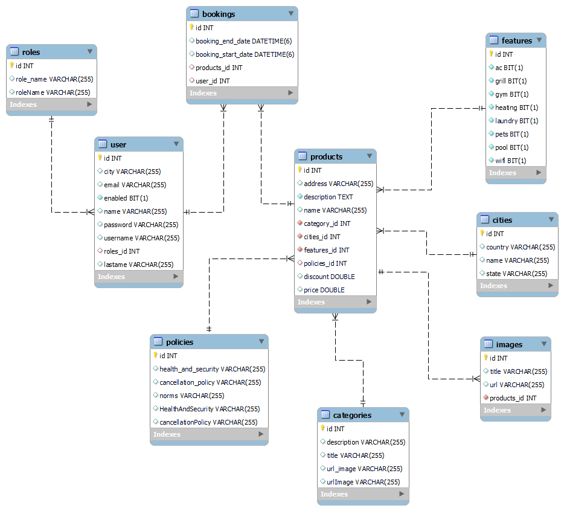
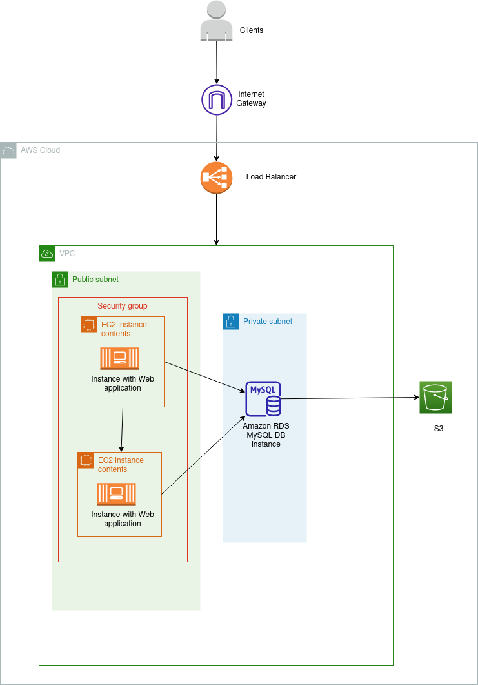
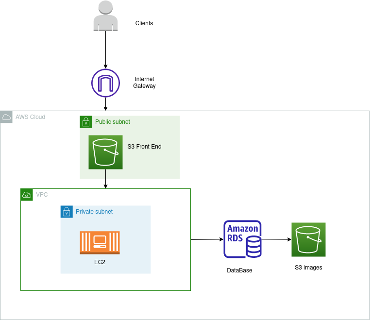

#  HomeSpot

## Contenidos
  - Proyecto
  - Equipo de trabajo
  - Metodología de trabajo
  - Bitácora del proyecto
  - Tecnologías utilizadas
  - Documentación técnica del proyecto

## Proyecto
    El Proyecto Homespot es un sitio web que permite alquilar temporalmente alojamientos en casas, departamentos,
    cabañas y casas de playa entre otros en distintos lugares turísticos de Argentina y Colombia.

 El sitio puede ser utilizado por usuarios para buscar alojamientos y realizar reservas y también por administradores, que además pueden agregar productos. Nuestro objetivo es desarrollar un sitio acorde a las  funcionalidades requeridas por el cliente. Hicimos hincapié en lograr que sea responsive, intuitivo y fácilmente navegable, para que los usuarios disfruten la experiencia y vuelvan a visitarlo.

### [***Sitio del proyecto***](http://homespot-frontend-app.s3-website.ca-central-1.amazonaws.com/)

## Equipo de trabajo

- ***Scrum Master :*** Mailen Slavutzky

- ***Product Owner :*** Diego Damian Testa

- ***Tech Lead :*** Daniel Villajuan

## Cindy Suarez

[ Cindy Suarez](https://www.linkedin.com/in/cindyailensuarez/)

#### Conocimiento al iniciar la carrera

Cindy es estudiante de la Licenciatura en Administración y comenzó el bootcamp CTD sin concimientos previos en programación. La posibilidad de hacer sinergía con su carrera y el amplio margen para ser creativa, fue la que la llevo a estudiar en Digital House.

#### Rol:
    Front end / Testing

#### Tareas

En testing realizo pruebas exploratorias con enfoque tour y pruebas estáticas. En front end se dedico al maqueteado, estilos con styled-component y a realizar la lógica de cierta funcionalidades de la página web.

Tecnología | Fortaleza |
------------ | ------------- |
Front End | 🔵 🔵 🔵 |
Back End | 🔵 ⚪ ⚪ |
Infraestructura | 🔵 ⚪ ⚪ |
Testing / QA | 🔵 🔵 ⚪ |
Bases de datos | 🔵 ⚪ ⚪ |

## Jimena Horbacovsky

[ Jimena Horbacovsky](https://www.linkedin.com/in/jimenashk)

#### Conocimiento al iniciar la carrera

Jimena es Diseñadora grafica & Publicitaria, empezo la carrera Certified Tech Developer sin conocimientos previos,
siendo esto un desafío muy grande para ella. Viniendo del mundo del diseño, ve como la creatividad y la innovación
se pueden aplicar de diferentes formas y eso me motiva a seguir explorando el mundo IT.

#### Rol:
    Back End / Bases de Datos / Testing

#### Tareas

En los diferentes sprints se desempeño realizando diferentes tareas en el área de Backend, Base de Datos,
y en menor medida en Testing (realizando test unitarios para el backend en el sprint 1). En el área de backend,
creo las diferentes entidades con sus respectivas capas según el patrón MVC, sus relaciones y el mapeo de las
tablas con clases de nuestro modelo. Creo filtros para la manipulación del contenido, donde tuve total control
desde la base de datos hasta el front e Implementé configuración de CORS. Además, implemento Spring Security
para darle seguridad a nuestra app logrando la correcta autenticación y autorización de los usuarios.

Tecnología | Fortaleza |
------------ | ------------- |
Front End | 🔵 ⚪ ⚪ |
Back End | 🔵 🔵 🔵 |
Infraestructura | 🔵 ⚪ ⚪ |
Testing / QA | 🔵 🔵 ⚪ |
Bases de datos | 🔵 🔵 🔵 |

## Juan Camilo Doncel Medina

[ Juan Camilo Doncel Medina](https://www.linkedin.com/in/juancamilodoncel)

#### Conocimiento al iniciar la carrera
Juan estudiante de Ingeniería Civil, empezó en el mundo de la programación por hobby en pandemia, después se fue interesando más por el tema y tomo la oportunidad que se le presentó en CTD

#### Rol:
    Front End

#### Tareas
Su trabajo fue desarrollar la interfaz gráfica de la aplicación con la mejor experiencia de usuario y funcionalidad posible, dando uso de las diferentes herramientas que nos provee react

Tecnología | Fortaleza |
------------ | ------------- |
Front End | 🔵 🔵 🔵 |
Back End | 🔵 ⚪ ⚪ |
Infraestructura | 🔵 ⚪ ⚪ |
Testing / QA | 🔵 🔵 ⚪ |
Bases de datos | 🔵 🔵 ⚪ |

## Lorena Perez Escobar

[ Lorena Perez Escobar](https://www.linkedin.com/in/lorenaperezescobar)

#### Conocimiento al iniciar la carrera

Lorena estudiante recién egresada del colegio, comenzó la carrera Certified Tech Developer sin conocimientos previos sobre programación. Tuvo la oportunidad de aprender algo nuevo y en un futuro conectarlo e implementarlo con su carrera de Ing. Biomédica lo que la impulso a tomar el desafío de aprender más sobre el mundo IT y las diferentes tecnologías.

#### Rol:
    Back End / Bases de Datos

#### Tareas

En el área de backend, implementó el modelo MVC a través del uso de diferentes dependencias, creó métodos y endpoints para que la API fuera más eficiente su consumo en el Front, creó, modificó, consultó e ingresó información en la base de datos. Configuró con Spring Security y JSON Web Token para la autenticación, el inicio de sesión y registro de usuarios.

Tecnología | Fortaleza |
------------ | ------------- |
Front End | 🔵 ⚪ ⚪ |
Back End | 🔵 🔵 🔵 |
Infraestructura | 🔵 🔵 ⚪ |
Testing / QA | 🔵 ⚪ ⚪ |
Bases de datos | 🔵 🔵 🔵 |

## Maria Lucila Arjona Campos

[ Lucila Arjona](https://www.linkedin.com/in/lucilaarjona)

#### Conocimiento al iniciar la carrera

Lucila es estudiante de ingenieria en sistemas de información en la universidad tecnologica nacional de Mendoza,
comenzo la carrera con conocimientos en UML, bases de datos, lenguajes como java, html, css y python. Viendo asi
la carrera como una gran oportunidad para aprendar sobre las nuevas tecnologias utilizadas actualmente en el mercado.

#### Rol:

    Infraestructura / Front End

#### Tareas

Realizo las tareas de parte de infraestuctura las cuales consistian en conectar de bases de datos RDS para almacenar información, crear un bucket S3 para almacenar los archivos de frontend, crear otro bucket publico para las imagenes, creación de EC2 para alojar nuestra API, configuracion de la API para desplegar el archivo .JAR de nuestro backend, implementación de pipeline CI/CD para deployar la aplicacion automaticamente.
Por parte de front creo el template de Reservas

Tecnología | Fortaleza |
------------ | ------------- |
Front End | 🔵 🔵 ⚪ |
Back End | 🔵 ⚪ ⚪ |
Infraestructura | 🔵 🔵 🔵 |
Testing / QA | 🔵 ⚪ ⚪ |
Bases de datos | 🔵 ⚪ ⚪ |

## Monica Bernal

[ Monica Bernal](https://www.linkedin.com/in/monica-alexandra-bernal-reyes-608789b8/)

#### Conocimiento al iniciar la carrera

Monica Estudio es Abogada y decidio cambiar la perspectiva de lo que realmente queria  para su vida optando por estudiar Certifed Tech Developer  de manera que todo lo que fue aprendiendo

#### Rol:

    Testing / Front End

#### Tareas

Comenzó con tareas de Front (formularios) y Testing realizando pruebas Automatizadas con Selenium y Postman y pruebas manuales exploratorias y unitarias con Jest tratando de encontrar la mayor cantidad de Bugs reportando al equipo lo encontrado y procurando la perfección de la aplicación.

Tecnología | Fortaleza |
------------ | ------------- |
Front End | 🔵 🔵 ⚪ |
Back End | 🔵 ⚪ ⚪ |
Infraestructura | 🔵 ⚪ ⚪ |
Testing / QA | 🔵 🔵 🔵 |
Bases de datos | 🔵 🔵 ⚪ |

## Metodología de trabajo

Trabajamos con Metodologías Ágiles. Para ello nos organizamos siguiendo las ceremonias de SCRUM
(lectura y validación del sprint, daily, weekly, review, retro), modularizando el proyecto en 4 Sprints de 2 semanas cada uno.
A lo largo del proyecto contamos con un Scrum Master, un Product Owner y el apoyo de diferentes
Tech Leads en caso que necesitáramos realizar consultas técnicas.
Utilizamos gitlab como herramienta de organización y asignación de issues y Metro Retro para asegurarnos
de mejorar como equipo de manera progresiva. Desde el comienzo del proyecto nos dividimos de manera clara
los roles pero también establecimos solucionar en grupo aquellas dudas que se presentaran a lo largo del desarrollo del proyecto.

## Bitácora del proyecto
[Planning de los sprint](https://docs.google.com/spreadsheets/d/1T7frqUP5oV-tce8_Ci_NY_h7-Dim_q0q2NXXd4AciJg/edit#gid=0)

### Sprint 1

En primer momento lo que se hizo fue exponer debilidades y fortalezas sobre cada rol del proyecto para
lograr una distribucion de issues de forma eficiente, para asi comenzar con la busqueda de nuestra identidad como equipo en el proyecto.

[Metro Reto Sprit 1](https://metroretro.io/board/LB12C9MHMK1K)

### Sprint 2

Para este segundo sprint lo que se logro fue terminarlo sin ningun carry over, contabamos con una dinamica de trabajo fluida,
lo que llevo a lograr terminarlo con exito. Como incoveniente que tuvimos fueron los conflictos con gitlab y aws, que junto con
la ayuda de los tl y documentación logramos solucionar.

[Metro Reto Sprit 2](https://metroretro.io/board/LBZWDEN4UM6Z)

### Sprint 3

Este sprint fue el mas desafiante contaba con un grado de dificultad muy alto, se presentaron dificultades con nuestro back end,
pero que junto a la documentacion, tl y ayuda de nuestros compañeros logramos superarlas y asi cumplir con los requerimientos del usuario.

[Metro Reto Sprit 3](https://metroretro.io/board/LB1JKNK6BT2Y)

### Sprint 4

Como objetivo para este sprint teniamos logra refactorizar el codigo, ultimar detalles del front, y terminar los testeos de la aplicación.
Como equipo destacamos que nuestras fortalezas y claves para lograr terminar satisfactoriamente este proyecto fue la comunicación, empatía, colaboración y constante feedback como grupo.

## Tecnologías utilizadas
- Servicios y herramientas empleadas
    - Gestion del proyecto
        - Gitlab issues
        - Discord
        - Zoom
        - Google Calendar
        - Meet
    - Desarrolo del proyecto
        - VSCode
        - Intellij
    - Sistema de control de versiones
        - Gitlab
- Front end
    - JavaScript
    - HTML
    - CSS
    - ReactJS
    - Axios
    - React Router V6
    - jwt-decode
    - react-calendar
    - formik
    - sweetalert2
    - react-image-gallery
    - Bootstrap
    - Material UI
    - Style component
- Back end
    - Java
    - Spring
    - Swagger
    - Hibernate
    - Spring boot
    - Maven
    - Apache
    - Tomcat
    - Lombok
    - Jwt
    - Json
- Base de datos
    - MySQL
    - MySQL Workbench
- Testing
    - Postman
    - Selenium
    - Jest
    - React library
    - Pruebas exploratorias
- Infraestructura
    - MySQL Workbench
    - CI/CD
    - AWS
        - S3
        - EC2
        - RDS

## Documentación técnica del proyecto

### Ambiente de desarrollo

Para comenzar debemos clonar el repositorio en Gitlab

**Con SSH:**

`$git clone git@gitlab.ctd.academy:ctd/proyecto-integrador-0822/1021-ft/grupo-02.git`

**Con HTTPS:**

`$git clone https://gitlab.ctd.academy/ctd/proyecto-integrador-0822/1021-ft/grupo-02.git`

### Front End

Para correr el proyecto, instale localmente las siguientes librerias

`$cd frontend`

`$npm i`

`$npm start`

### Back End

[Para ver documentacion en swagger](http://3.137.124.253:8080/swagger-doc/swagger-ui/index.html#/)

### Bases de Datos

#### **Diagrama DER**

### Infraestructura

Primer diagrama planteado por el equipo

Diagrama definitivo

Diagrama definitivo donde la aplicacion esta deployada en [***Sitio del proyecto***](http://homespot-frontend-app.s3-website.ca-central-1.amazonaws.com/) Trabajamos con el
DNS route 53 el servidor de nombres de dominio de Amazon. El frontend está almacenado en un Bucket S3 y las imágenes están guardadas en otro Bucket para que sea de más rápido acceso.La API del backend está desplegada en EC2, que es un conjunto de
servicios de AWS que permite cargar versiones de nuestra aplicación. Por último implementamos una RDS la cual está conectada a nuestra API para poder almacenar los datos de nuestros usuarios.

### Testing

[Planillas de Testing](https://docs.google.com/spreadsheets/d/10hyU7HHlmKzJ6dVmqMa8xKwBE0qGLRw9QjdSY4b3LCs/edit?usp=sharing)

[Informe final de Testing](https://docs.google.com/document/d/1zY1aMIWNTVwitoaO0mLGpJ3tLJfQPN8Y/edit?usp=sharing&ouid=106580342266172435824&rtpof=true&sd=true)

### Para ver la wiki del proyecto

`$cd wiki/homespot`

`$mkdocs serve`

*Open:*  `http://127.0.0.1:8000`

For full documentation visit [mkdocs.org](https://mkdocs.org).