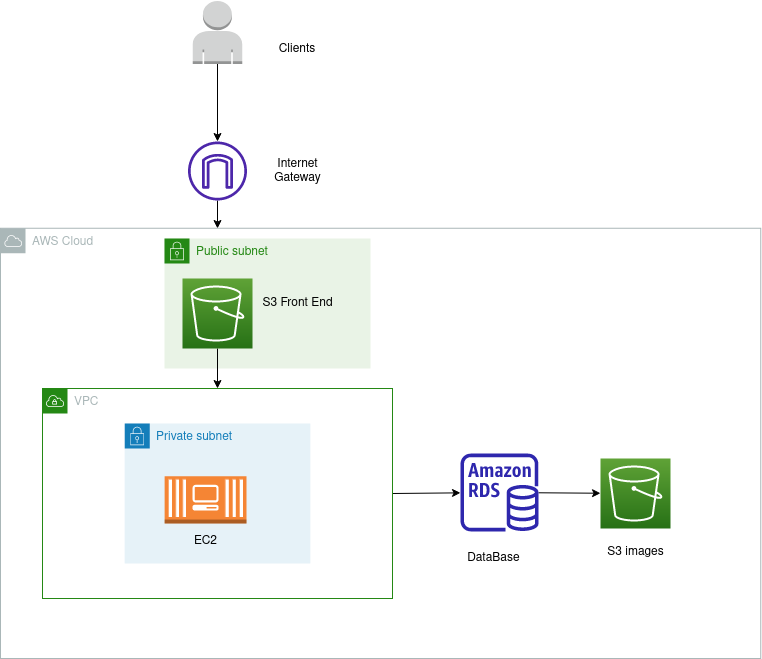

#  HomeSpot

## Contenidos
  - Proyecto
  - Equipo de trabajo
  - Metodología de trabajo
  - Bitácora del proyecto
  - Tecnologías utilizadas
  - Documentación técnica del proyecto

## Proyecto
    El Proyecto Homespot es un sitio web que permite alquilar temporalmente alojamientos en casas, departamentos,
    cabañas y casas de playa entre otros en distintos lugares turísticos de Argentina y Colombia.

 El sitio puede ser utilizado por usuarios para buscar alojamientos y realizar reservas y también por administradores, que además pueden agregar productos. Nuestro objetivo es desarrollar un sitio acorde a las  funcionalidades requeridas por el cliente. Hicimos hincapié en lograr que sea responsive, intuitivo y fácilmente navegable, para que los usuarios disfruten la experiencia y vuelvan a visitarlo.

### [***Sitio del proyecto***](http://homespot-frontend-app.s3-website.ca-central-1.amazonaws.com/)

## Equipo de trabajo

- ***Scrum Master :*** Mailen Slavutzky

- ***Product Owner :*** Diego Damian Testa

- ***Tech Lead :*** Daniel Villajuan

## Cindy Suarez

Tecnología | Fortaleza |
------------ | ------------- |
Front End | 🔵 🔵 ⚪ |
Back End | 🔵 ⚪ |
Infraestructura | 🔵 ⚪ |
Testing / QA | 🔵 ⚪ |
Bases de datos | 🔵 ⚪ |

## Jimena Horbacovsky

 [Jimena Horbacovsky](www.linkedin.com/in/jimenashk)

#### Conocimiento al iniciar la carrera

Jimena es Diseñadora grafica & Publicitaria, empezo la carrera Certified Tech Developer sin conocimientos previos, 
siendo esto un desafío muy grande para ella. Viniendo del mundo del diseño, ve como la creatividad y la innovación 
se pueden aplicar de diferentes formas y eso me motiva a seguir explorando el mundo IT.

#### Rol:
    Back End / Bases de Datos / Testing

#### Tareas

En los diferentes sprints se desempeño realizando diferentes tareas en el área de Backend, Base de Datos, 
y en menor medida en Testing (realizando test unitarios para el backend en el sprint 1). En el área de backend, 
creo las diferentes entidades con sus respectivas capas según el patrón MVC, sus relaciones y el mapeo de las 
tablas con clases de nuestro modelo. Creo filtros para la manipulación del contenido, donde tuve total control 
desde la base de datos hasta el front e Implementé configuración de CORS. Además, implemento Spring Security 
para darle seguridad a nuestra app logrando la correcta autenticación y autorización de los usuarios.

Tecnología | Fortaleza |
------------ | ------------- |
Front End | 🔵 ⚪ ⚪ |
Back End | 🔵 🔵 🔵 |
Infraestructura | 🔵 ⚪ ⚪ |
Testing / QA | 🔵 🔵 ⚪ |
Bases de datos | 🔵 🔵 🔵 |

## Juan Camilo Docel

Tecnología | Fortaleza |
------------ | ------------- |
Front End | 🔵 🔵 ⚪ |
Back End | 🔵 ⚪ |
Infraestructura | 🔵 ⚪ |
Testing / QA | 🔵 ⚪ |
Bases de datos | 🔵 ⚪ |

## Lorena Perez Escobar

Tecnología | Fortaleza |
------------ | ------------- |
Front End | 🔵 🔵 ⚪ |
Back End | 🔵 ⚪ |
Infraestructura | 🔵 ⚪ |
Testing / QA | 🔵 ⚪ |
Bases de datos | 🔵 ⚪ |

## Maria Lucila Arjona Campos

 [Lucila Arjona](www.linkedin.com/in/lucilaarjona)

#### Conocimiento al iniciar la carrera

Lucila es estudiante de ingenieria en sistemas de información en la universidad tecnologica nacional de Mendoza,
comenzo la carrera con conocimientos en UML, bases de datos, lenguajes como java, html, css y python. Viendo asi
la carrera como una gran oportunidad para aprendar sobre las nuevas tecnologias utilizadas actualmente en el mercado.

#### Rol:
    Infraestructura / Front End

#### Tareas
 - Conexión de bases de datos RDS para almacenar información.
 - Bucket S3 para almacenar los archivos de frontend
 - Bucket publico para las imagenes
 - Creación de EC2 para alojar nuestra API
 - Configuracion de la API para desplegar el archivo .JAR de nuestro backend
 - Implementación de pipeline CI/CD para deployar la aplicacion automaticamente

Tecnología | Fortaleza |
------------ | ------------- |
Front End | 🔵 🔵 ⚪ |
Back End | 🔵 ⚪ |
Infraestructura | 🔵 🔵 🔵 |
Testing / QA | 🔵 ⚪ ⚪ |
Bases de datos | 🔵 ⚪ ⚪ |

## Monica Bernal

Tecnología | Fortaleza |
------------ | ------------- |
Front End | 🔵 🔵 ⚪ |
Back End | 🔵 ⚪ |
Infraestructura | 🔵 ⚪ |
Testing / QA | 🔵 ⚪ |
Bases de datos | 🔵 ⚪ |

## Metodología de trabajo

Trabajamos con Metodologías Ágiles. Para ello nos organizamos siguiendo las ceremonias de SCRUM 
(lectura y validación del sprint, daily, weekly, review, retro), modularizando el proyecto en 4 Sprints de 2 semanas cada uno.
A lo largo del proyecto contamos con un Scrum Master, un Product Owner y el apoyo de diferentes 
Tech Leads en caso que necesitáramos realizar consultas técnicas.
Utilizamos gitlab como herramienta de organización y asignación de issues y Metro Retro para asegurarnos
de mejorar como equipo de manera progresiva. Desde el comienzo del proyecto nos dividimos de manera clara
los roles pero también establecimos solucionar en grupo aquellas dudas que se presentaran a lo largo del desarrollo del proyecto.

## Bitácora del proyecto
[Planning de los sprint](https://docs.google.com/spreadsheets/d/1T7frqUP5oV-tce8_Ci_NY_h7-Dim_q0q2NXXd4AciJg/edit#gid=0)

### Sprint 1

En primer momento lo que se hizo fue exponer debilidades y fortalezas sobre cada rol del proyecto para lograr una distribucion de issues de forma eficiente.

[Metro Reto Sprit 1](https://metroretro.io/board/LB12C9MHMK1K)

### Sprint 2

[Metro Reto Sprit 2](https://metroretro.io/board/LBZWDEN4UM6Z)

### Sprint 3

[Metro Reto Sprit 3](https://metroretro.io/board/LB1JKNK6BT2Y)

### Sprint 4

## Tecnologías utilizadas
- Servicios y herramientas empleadas
    - Gestion del proyecto
        - Gitlab issues
        - Discord
        - Zoom
        - Google Calendar
        - Meet
    - Desarrolo del proyecto
        - VSCode
        - Intellij
    - Sistema de control de versiones
        - Gitlab
- Front end
    - React
- Back end
    - Java
    - Spring
    - Swagger
- Base de datos
    - MySQL
    - MySQL Workbench
- Testing
    - Postman
    - Selenium
    - Jest
- Infraestructura
    - MySQL workbench
    - AWS
        - S3
        - EC2
        - RDS

## Documentación técnica del proyecto

### Ambiente de desarrollo

Para comenzar debemos clonar el repositorio en Gitlab

**Con SSH:**

`$git clone git@gitlab.ctd.academy:ctd/proyecto-integrador-0822/1021-ft/grupo-02.git`

**Con HTTPS:**

`$git clone https://gitlab.ctd.academy/ctd/proyecto-integrador-0822/1021-ft/grupo-02.git`

Para correr el proyecto, instale localmente las siguientes librerias

`$git checkout frontmain`
`$cd frontend`
`$npm i`
`$npm start`
### Back End

[Para ver documentacion en swagger](
http://3.137.124.253:8080/swagger-doc/swagger-ui/index.html#/)

#### **Diagrama DER**

### Infraestructura

Primer diagrama planteado por el equipo

Diagrama definitivo

Diagrama definitivo donde la aplicacion esta deployada en [***Sitio del proyecto***](http://homespot-frontend-app.s3-website.ca-central-1.amazonaws.com/) Trabajamos con el
DNS route 53 el servidor de nombres de dominio de Amazon. El frontend está almacenado en un Bucket S3 y las imágenes están guardadas en otro Bucket para que sea de más rápido acceso.La API del backend está desplegada en EC2, que es un conjunto de
servicios de AWS que permite cargar versiones de nuestra aplicación. Por último implementamos una RDS la cual está conectada a nuestra API para poder almacenar los datos de nuestros usuarios.

### Testing

[Planillas de Testing](https://docs.google.com/spreadsheets/d/10hyU7HHlmKzJ6dVmqMa8xKwBE0qGLRw9QjdSY4b3LCs/edit?usp=sharing)

### Para ver la wiki del proyecto

`$git checkout main`

`$cd wiki/homespot`

`$mkdocs serve`

[Open this link](http://127.0.0.1:8000)

For full documentation visit [mkdocs.org](https://mkdocs.org).